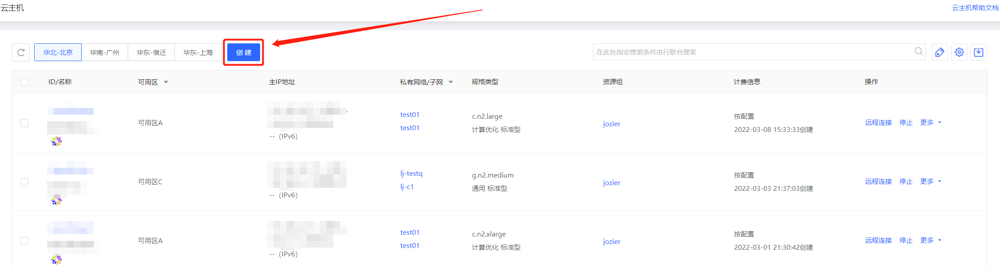
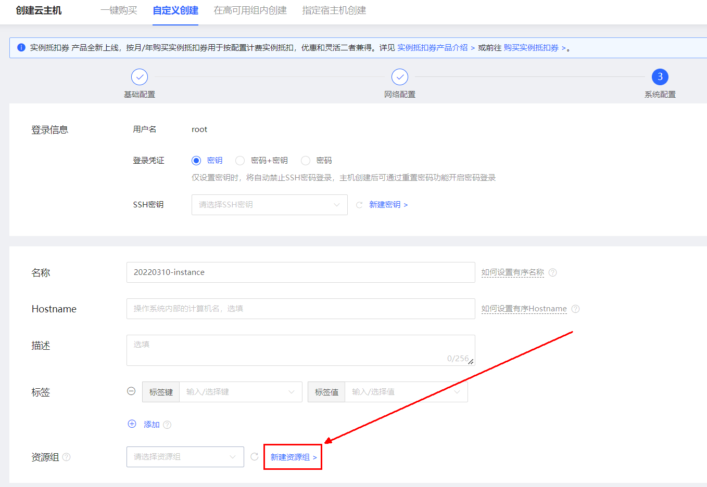

# 添加资源组

创建主机时，支持添加资源组，如不选择将加入默认资源组

## 操作步骤

- 进入[京东云控制台](https://cns-console.jdcloud.com/host/compute/list)，访问实例列表页
- 点击创建进入实例创建页

- 在【自定义创建】、【高可用组内创建】、【指定宿主机创建】的系统配置页面中点击新建资源组超链，即可添加资源组

- 选择需要转入的资源组即可变更单一实例所在资源组
