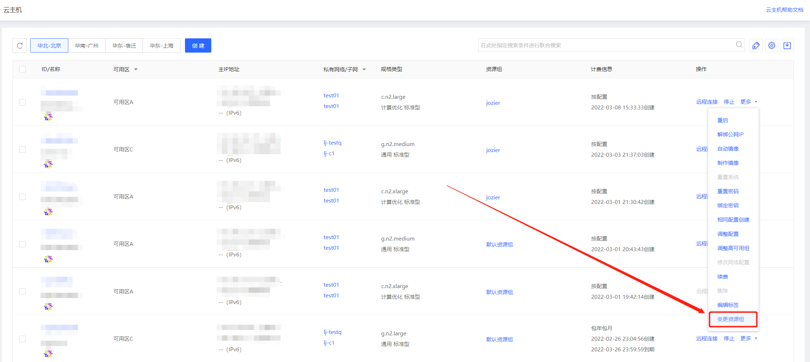
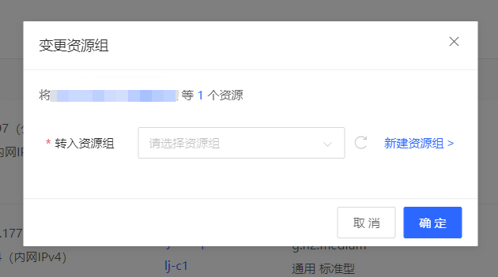
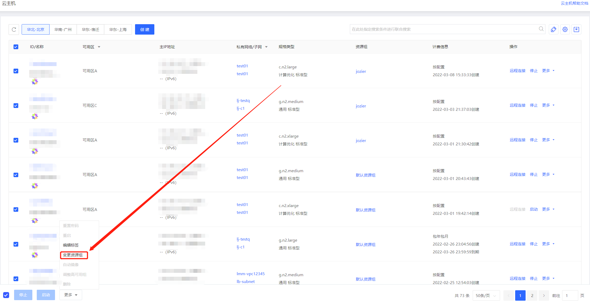
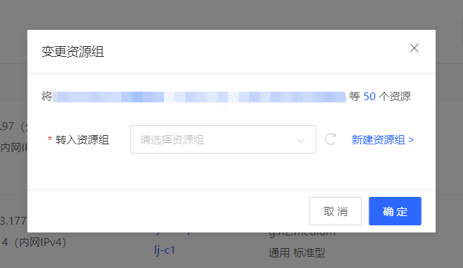
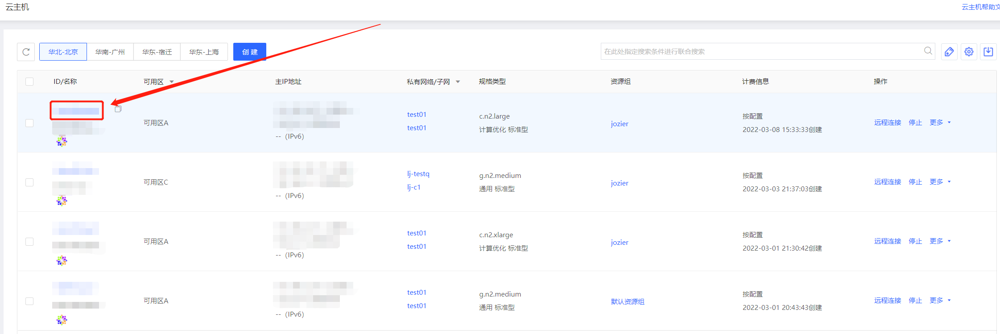
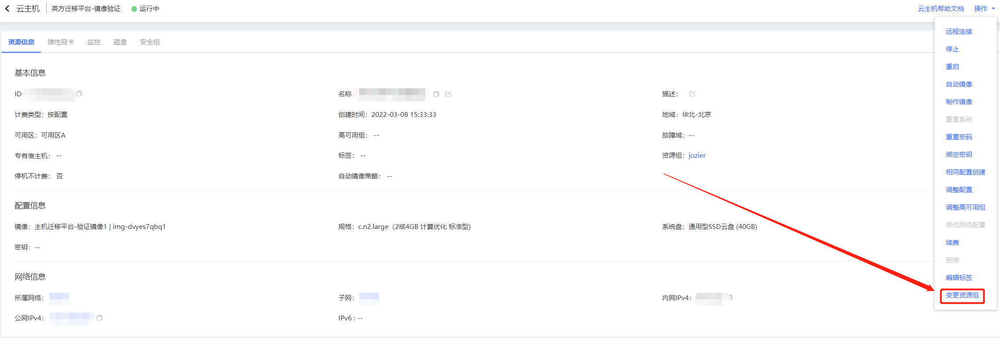

# 变更资源组

实例加入资源组后，您可以通过本文方法来变更实例所在资源组

## 操作步骤

1.通过列表页变更

- 访问[云主机控制台](https://cns-console.jdcloud.com/host/compute/list)，进入实例列表页面。或访问京东云控制台点击顶部导航栏 弹性计算-云主机，进入实例列表页

- 点击实例列表页操作-更多-变更资源组

- 选择需要转入的资源组即可变更单一实例所在资源组

- 筛选实例后点击左下角更多-变更资源组

- 选择需要转入的资源组即可批量变更实例所在资源组

2.通过详情页变更

- 在实例列表页点击实例id进入实例详情页

- 在实例详情页右上角，点击操作-变更资源组可对资源组进行单个变更

