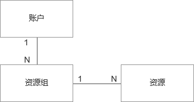

# 资源组概述

资源指的是具有特定功能的实体（例如云盘、云主机、数据库），资源组（Resource group）可以理解为资源的集合，资源组可以对其中的资源定义关系和约束，从而更加高效的进行资源管理。【控制台菜单： 管理-资源管理】
资源组归属于主账号，每个主账号下都设有 “默认资源组”；一个资源必须属于且仅属于一个资源组。

支持功能：
添加资源组
变更资源组
[筛选资源组](https://www.jdcloud.com/)
